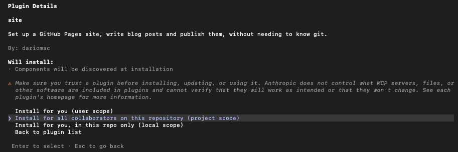

# lite-site-tools

A Claude Code plugin for building a personal website with a blog on GitHub Pages,
using your own domain. You don't need to know git: each step is a slash command.

## What you need

- A GitHub account
- A Claude plan that includes Claude Code: Pro or Max. The free plan doesn't
  include it. A Team or Enterprise seat from work, or an Anthropic Console
  (pay-as-you-go API) account, also works.
- Claude Code itself. The Code tab in the Claude desktop app is the easiest way
  to use it.
- A domain name, if you want your own address. You can add it later.

`/site:setup` installs and signs in to everything else (git and the GitHub CLI) for you.
On Windows it may ask you to restart Claude Code once, after installing Git.

## Get started

1. Create a new, empty folder for your website, for example `my-website` in your
   home folder.
2. Open that folder in Claude Code.
3. Add this plugin's marketplace:
   ```
   /plugin marketplace add dariomac/lite-site-tools
   ```
4. Install the plugin **for this folder only**:
   ```
   /plugin install site@lite-site-tools
   ```

   

   When asked where to install it, choose **"Install for all collaborators on
   this repository (project scope)"**. You're the only collaborator; this option
   saves the setting inside your website folder, so it also works if you ever
   set up your site on another computer.
5. Run:
   ```
   /site:setup
   ```

Always open your website folder in Claude Code when you want to work on your
site. If the `/site:` commands don't show up, check you opened the right folder.

## Commands

Type `/site` to see them all.

| Command | What it does |
|---|---|
| `/site:setup` | One-time setup: checks your tools, signs you in to GitHub, creates your site and puts it live |
| `/site:new-post <title>` | Creates a new blog post, ready to write |
| `/site:publish` | Publishes your changes to the live site |
| `/site:connect-domain <domain>` | Connects your own domain and tells you exactly what to set at your registrar |
| `/site:status` | Shows whether the latest publish worked and where your site is live |
| `/site:theme <name>` | Changes how your site looks. Run it without a name to see the choices |
| `/site:upgrade` | Updates a site made with an older version of the plugin, so it gets new features |

## Writing posts

Posts are plain text files written in **Markdown**, a simple way to add
formatting with a few symbols. The ones you'll use most:

| To get | Write |
|---|---|
| **bold** | `**bold**` |
| *italic* | `*italic*` |
| A heading | `## Heading` on its own line |
| A link | `[link text](https://example.com)` |
| A list | `- item` on each line (or `1.` for a numbered list) |
| `code` | `` `code` `` |
| A code block | three backticks ```` ``` ```` on the lines before and after the code |
| A quote | `> quoted text` |

For images, the easiest way is to ask Claude: "add this picture to my post",
with the image file attached or its location on your computer. It puts the file
in the right place and writes the Markdown for you.

If you have a doubt about how to write something:

- [Markdown Cheat Sheet](https://www.markdownguide.org/cheat-sheet/): a one-page
  summary of everything Markdown can do. Start here.
- [GitHub's writing and formatting guide](https://docs.github.com/en/get-started/writing-on-github/getting-started-with-writing-and-formatting-on-github/basic-writing-and-formatting-syntax):
  more detail, with examples. A few things on that page (@mentions, emoji
  shortcodes like `:smile:`, and colored alert boxes) only work on GitHub, not
  on your site.

You can also just ask Claude, for example "how do I make a table in my post?".

## Themes

Your site starts with the **clean** look. See all the themes in
[THEMES.md](THEMES.md) and switch with `/site:theme <name>`. Switching never
touches your posts, your pages or your own style changes.

## Getting new commands

Open `/plugin`, choose the `lite-site-tools` marketplace and turn on auto-update.
You can also run `/plugin marketplace update lite-site-tools` whenever you're told
there's a new version.

Some new versions add features your existing site needs a small update for.
`/site:status` tells you when that's the case, and `/site:upgrade` does it
without changing your posts or how your site looks.

## Working on another computer

Your site's settings remember the plugin, but each computer needs it installed
once. Open your website folder there and repeat steps 3 and 4.
