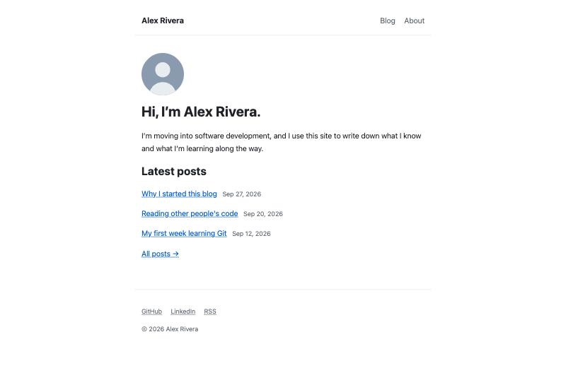
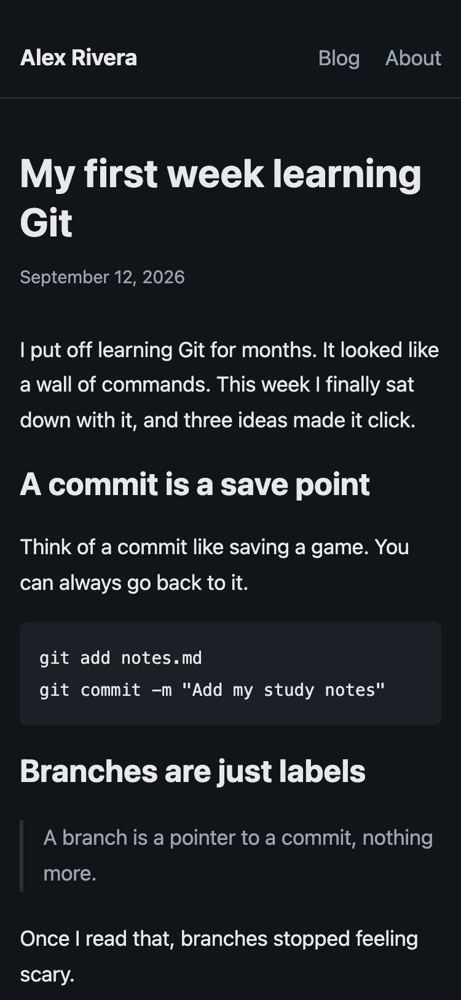
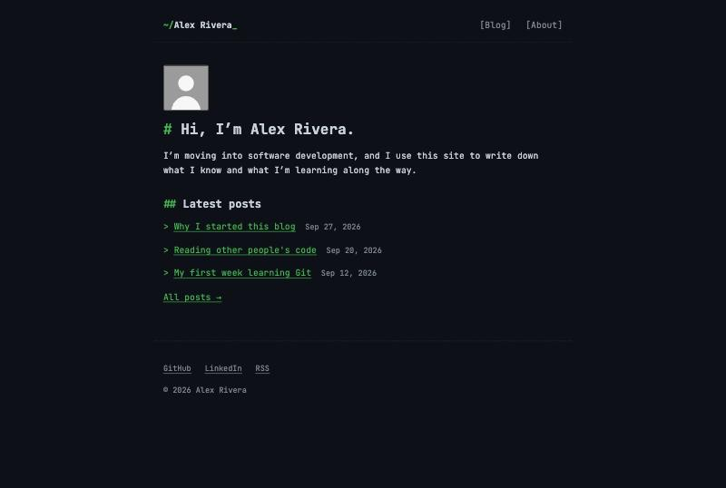
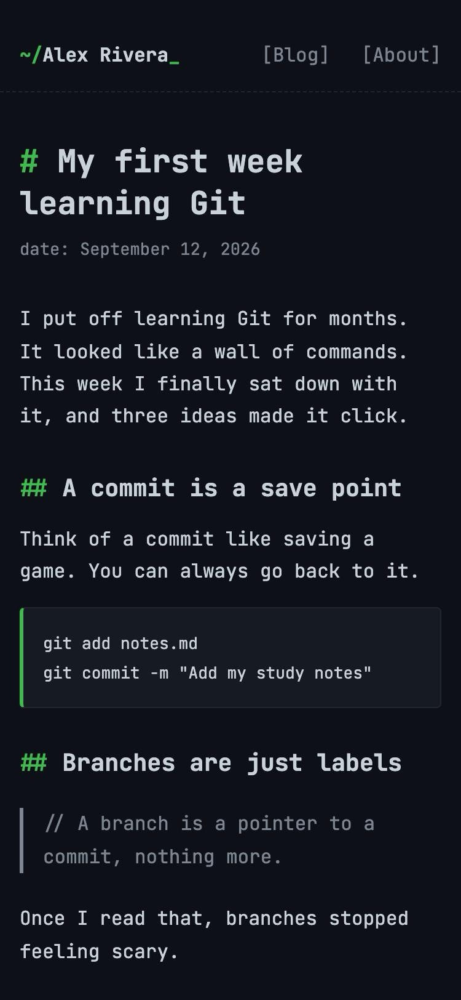

# Themes

Every theme works with every command, and switching never touches your posts,
your pages or your own style changes in `custom.css`. Switch with
`/site:theme <name>`; switch back the same way.

Screenshots use a demo site. Left: home page on a desktop in light mode.
Right: a post on a phone in dark mode.

## clean

System fonts, white background, blue links, lots of space. Every new site starts here.

 

## editorial

Serif type on warm paper, larger text and a narrow column. Made for long reads.

 

## terminal

Monospace, always dark, green accent and `#` headings. A developer's notebook.

 

## warm

Rounded type, soft sand colors, coral accent and a big photo on the home page.

 
